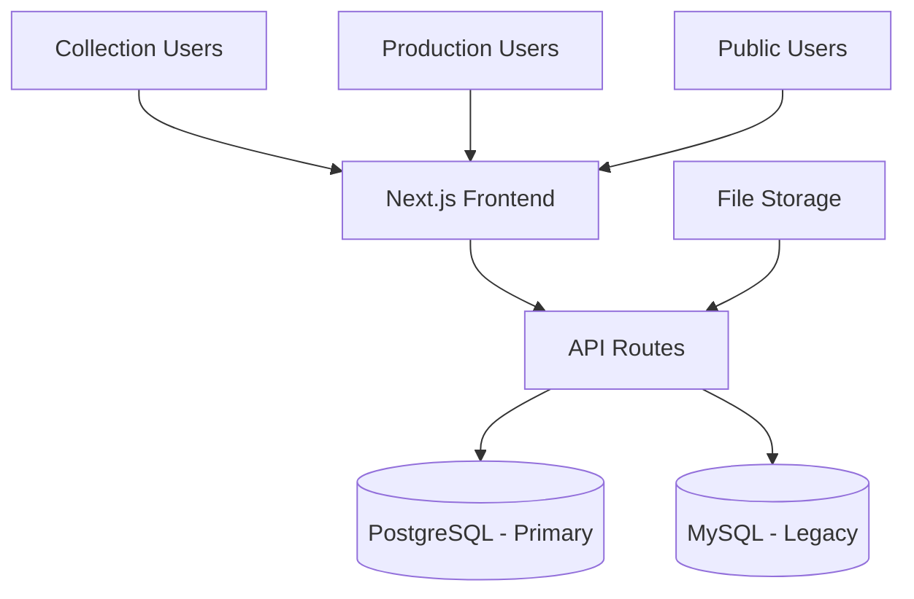

# Implementation Plan: Ceramic Product Collections & Production Tracking System

**Feature Branch**: `1-ceramic-prod-system`
**Created**: 2025-11-02
**Status**: Planning Phase
**Spec Reference**: [spec.md](spec.md)

## Executive Summary

This plan outlines the implementation of a comprehensive enterprise application for managing ceramic product collections and production tracking. The system will support dual database architecture (MySQL migration to PostgreSQL), role-based access control, and complex production workflows with dynamic process management.

## Architecture Overview

## Implementation Phases

### Phase 1: Foundation & Database Migration (Week 1-2)

#### 1.1 Database Setup & Migration
- Create PostgreSQL schema based on existing MySQL structure
- Implement ETL migration scripts for 11,000+ existing collections
- Set up dual database connections in Next.js
- Validate data integrity post-migration

#### 1.2 Authentication & Authorization
- Implement role-based access control (Collection, Production, Public)
- Set up session management or OAuth2
- Create user management system

#### 1.3 Core Data Models
- Product Collection entity with client associations
- Client entity with regions and departments
- Purchase Order (POL) entity
- Production Stage and Process Name entities

### Phase 2: Product Collections Module (Week 3-4)

#### 2.1 Collection Management
- CRUD operations for product collections
- Duplicate action for faster data input
- Client association and exclusivity types (Exclusive, Exclusive-Group, General)
- Frontend public access (no login required)
- Search and filtering capabilities
- Product reference document printing with photos

#### 2.2 Client Management
- Region and department management
- Client-product relationship handling
- Data validation and constraints

### Phase 3: Production Tracking Module (Week 5-7)

#### 3.1 POL Management
- Purchase order creation and management
- Product details integration from collections
- Deadline and status tracking

#### 3.2 Material Requirements Planning
- Dynamic process name management within stages
- Material calculation (clay amounts, firing types, etc.)
- Difficulty level assessment
- Process customization by production users

#### 3.3 Production Planning & Calendar
- Drag-and-drop weekly calendar interface
- Worker group assignments
- Overtime scheduling (Sat/Sun highlighting)
- Print-ready work plans

#### 3.4 Quantity Validation & Alerts
- Stage-by-stage quantity tracking
- Sub-process validation within stages
- Alert system for discrepancies
- 15% buffer management

### Phase 4: Public Dashboard & Reporting (Week 8-9)

#### 4.1 Public Production Tracking
- Multi-filter search (PO, Client, Item Code, Date Range, Process Stage)
- Sortable and paginated results
- Real-time status updates

#### 4.2 Logging & Revision System
- Production event logging
- Revision ticket workflow (submission → approval → collection updates)
- Attachment handling

### Phase 5: Testing & Deployment (Week 10-11)

#### 5.1 Quality Assurance
- Unit testing for all modules
- Integration testing for database operations
- User acceptance testing with sample data
- Performance testing (50 concurrent users)

#### 5.2 Deployment & Migration
- Production environment setup
- Data migration execution
- Rollback procedures
- Monitoring and alerting setup

## Technical Stack

### Core Framework
- **Frontend**: Next.js 15 - The React framework for production with App Router
- **TypeScript**: TypeScript 5 - Type-safe JavaScript for better developer experience
- **Styling**: Tailwind CSS 4 - Utility-first CSS framework for rapid UI development

### UI Components & Styling
- **UI Library**: shadcn/ui - High-quality, accessible components built on Radix UI
- **Icons**: Lucide React - Beautiful & consistent icon library
- **Animations**: Framer Motion - Production-ready motion library for React
- **Themes**: Next Themes - Perfect dark mode in 2 lines of code

### Forms & Validation
- **Form Handling**: React Hook Form - Performant forms with easy validation
- **Schema Validation**: Zod - TypeScript-first schema validation

### State Management & Data Fetching
- **State**: Zustand - Simple, scalable state management
- **Data Fetching**: TanStack Query - Powerful data synchronization for React
- **HTTP Client**: Axios - Promise-based HTTP client

### Database & Backend
- **Database**: PostgreSQL (primary), MySQL (legacy)
- **ORM**: Prisma - Next-generation Node.js and TypeScript ORM
- **Authentication**: NextAuth.js - Complete open-source authentication solution
- **API Routes**: Next.js API Routes

### Advanced UI Features
- **Tables**: TanStack Table - Headless UI for building tables and datagrids
- **Drag & Drop**: DND Kit - Modern drag and drop toolkit for React
- **Charts**: Recharts - Redefined chart library built with React and D3
- **Image Processing**: Sharp - High performance image processing

### Internationalization & Utilities
- **i18n**: Next Intl - Internationalization library for Next.js
- **Date Utilities**: Date-fns - Modern JavaScript date utility library
- **React Hooks**: ReactUse - Collection of essential React hooks for modern development

### Deployment & Infrastructure
- **Containerization**: Docker
- **Orchestration**: Kubernetes for scalability
- **File Storage**: Local or cloud storage for photos/documents

### Why This Stack?
- **Fast Development**: Pre-configured tooling and best practices
- **Beautiful UI**: Complete shadcn/ui component library with advanced interactions
- **Type Safety**: Full TypeScript configuration with Zod validation
- **Responsive**: Mobile-first design principles with smooth animations
- **Database Ready**: Prisma ORM configured for rapid backend development
- **Auth Included**: NextAuth.js for secure authentication flows
- **Data Visualization**: Charts, tables, and drag-and-drop functionality
- **i18n Ready**: Multi-language support with Next Intl
- **Production Ready**: Optimized build and deployment settings
- **AI-Friendly**: Structured codebase perfect for AI assistance

## Risk Assessment & Mitigation

### High Risk
- **Database Migration**: Complex migration of 11,000+ records
  - *Mitigation*: Phased migration with rollback capabilities, extensive testing

- **Dual Database Complexity**: Managing MySQL + PostgreSQL connections
  - *Mitigation*: Abstract database operations, clear separation of concerns

### Medium Risk
- **Dynamic Process Management**: User-defined processes within stages
  - *Mitigation*: Flexible schema design, validation rules

- **Real-time Validation**: Complex quantity tracking across stages
  - *Mitigation*: Modular validation logic, comprehensive error handling

## Success Metrics

- Database migration: 100% data integrity, <4 hours downtime
- Performance: <2s page loads, 50+ concurrent users
- User Adoption: 90% task completion rate
- Quality: <5% defect rate in production

## Dependencies

- Next.js environment setup
- PostgreSQL and MySQL database access
- File storage solution
- Development team availability
- User acceptance testing participants

## Timeline & Milestones

| Phase | Duration | Deliverables | Success Criteria |
|-------|----------|--------------|------------------|
| Foundation | 2 weeks | DB migration, auth setup | Clean data migration, working auth |
| Collections | 2 weeks | Collection CRUD, client mgmt | Full collection management |
| Production | 3 weeks | POL, planning, validation | Complete production workflow |
| Dashboard | 2 weeks | Public tracking, logging | Functional public interface |
| Testing | 2 weeks | QA complete, deployment | System ready for production |

## Next Steps

1. Review and approve this implementation plan
2. Set up development environment
3. Begin Phase 1 implementation
4. Schedule regular progress reviews

---

*This plan will be updated as implementation progresses and new requirements emerge.*